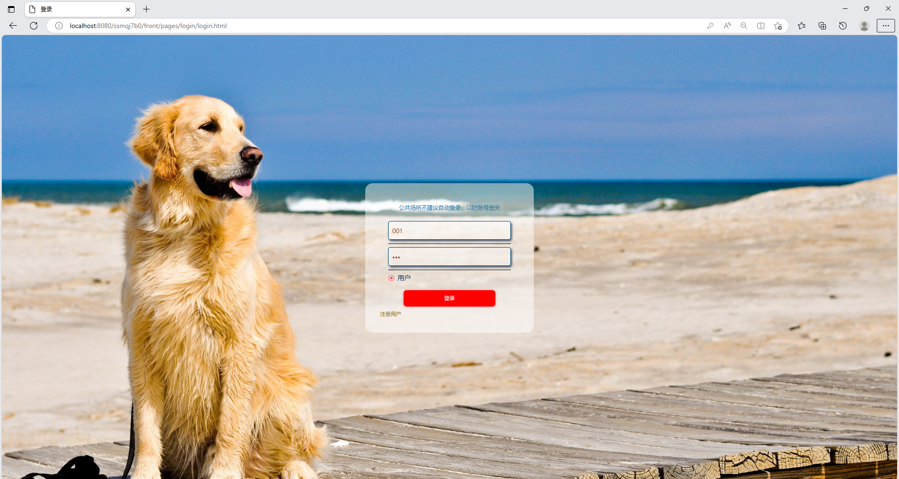
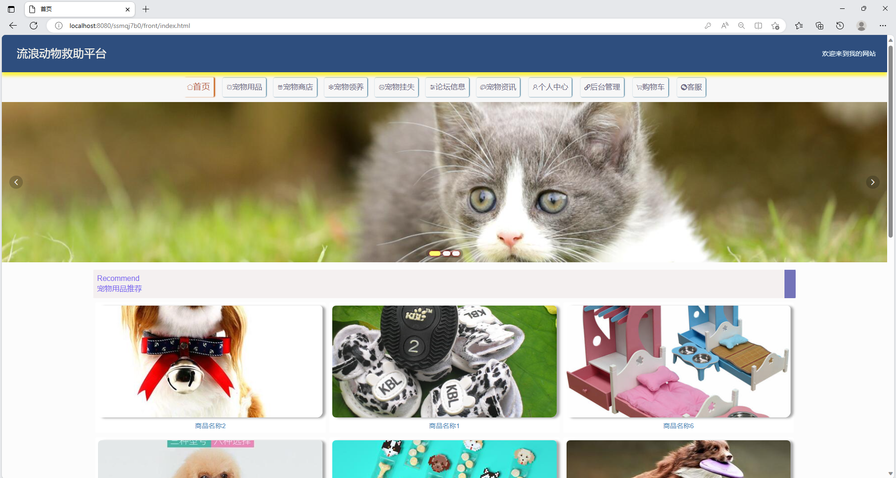
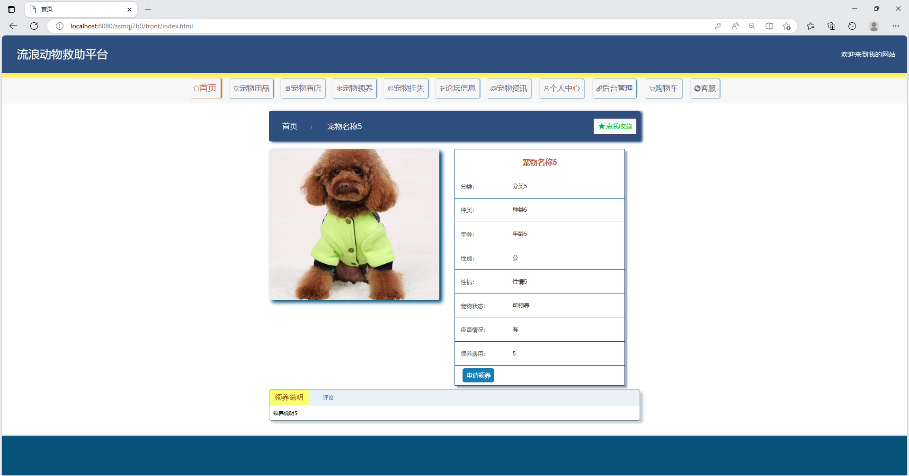
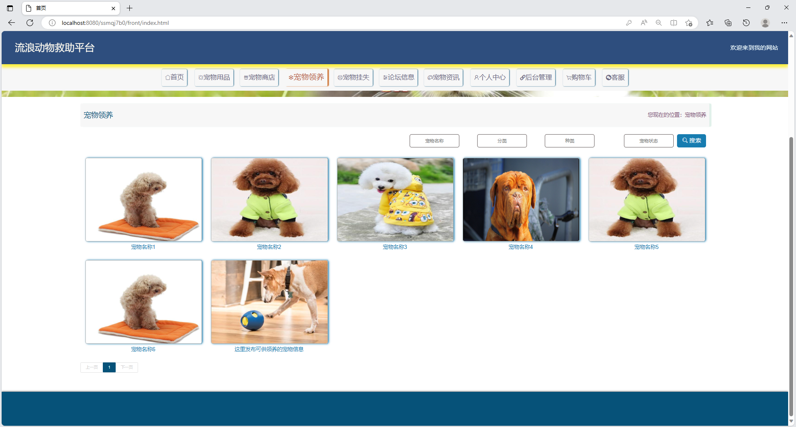
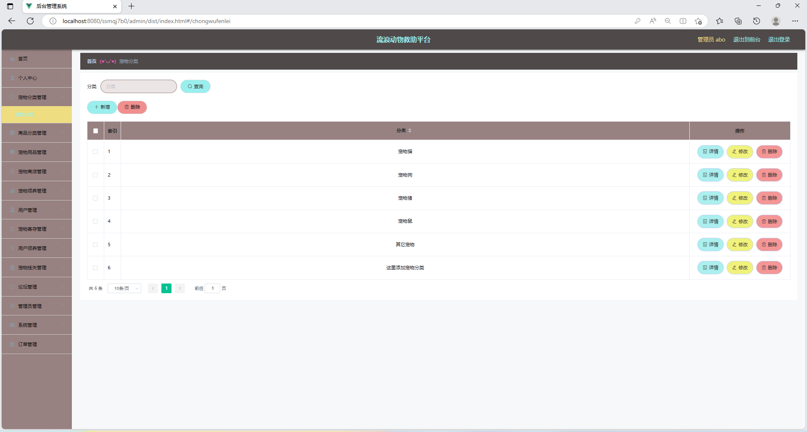
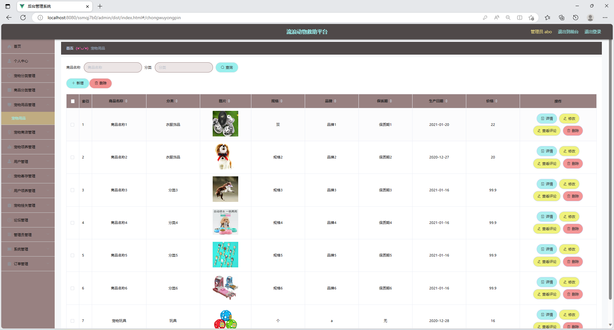
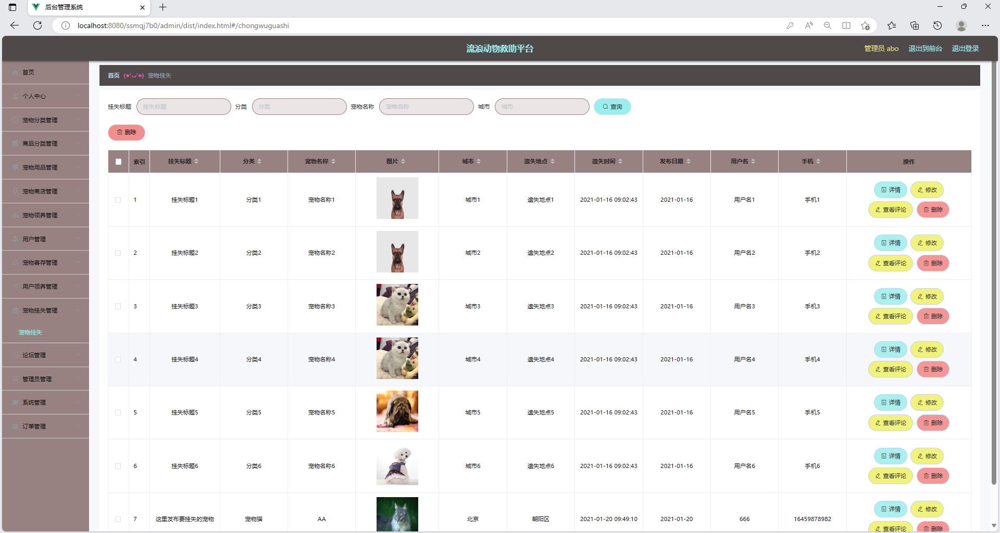

# 宠物领养系统

### 有问题，或者需要协助调试运行项目的, 可以+扣扣：2529519551，或者+ wx ：xzxj0206 注明项目，“git+项目名称” ，如：“git学生宿舍管理系统”

## 一、项目介绍

宠物领养系统，流浪动物救助平台

前后端没有分离

技术栈：java+ssm+vue+mysql+mybatis+maven

用户端：首页，宠物用品，宠物商店，宠物领养，宠物挂失，论坛信息，宠物咨询，个人中心，购物车

管理员后台：首页，个人中心，宠物分类管理，商品分类管理，宠物用品管理，宠物商店管理，宠物领养管理，用户管理，宠物寄存管理，用户管理系统，宠物挂失管理，论坛管理

## 二、系统运行界面

## 三、系统部分功能界面截图

