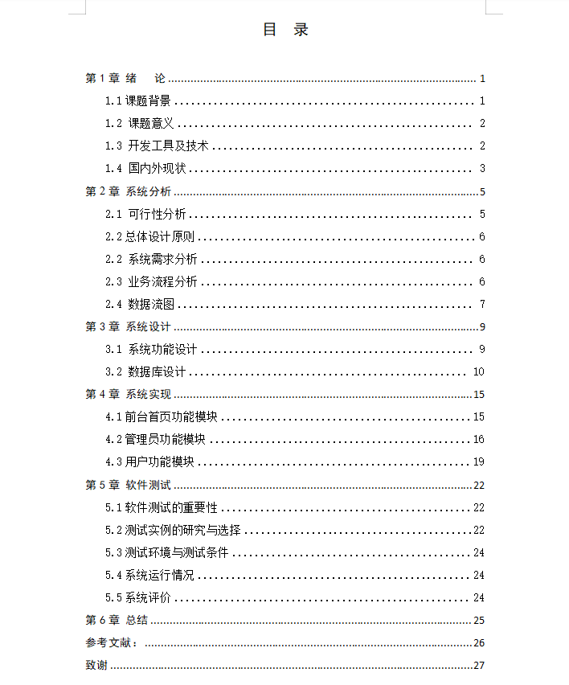
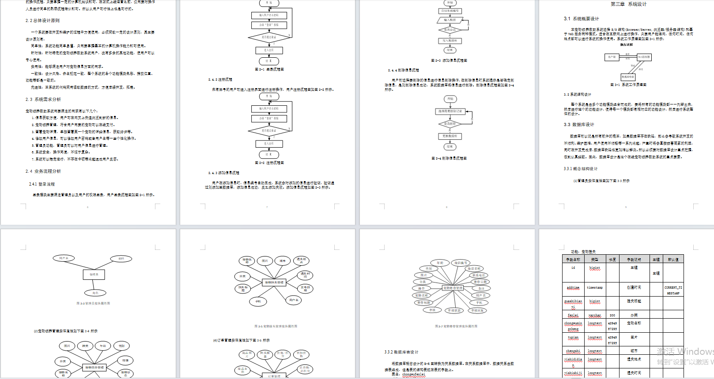
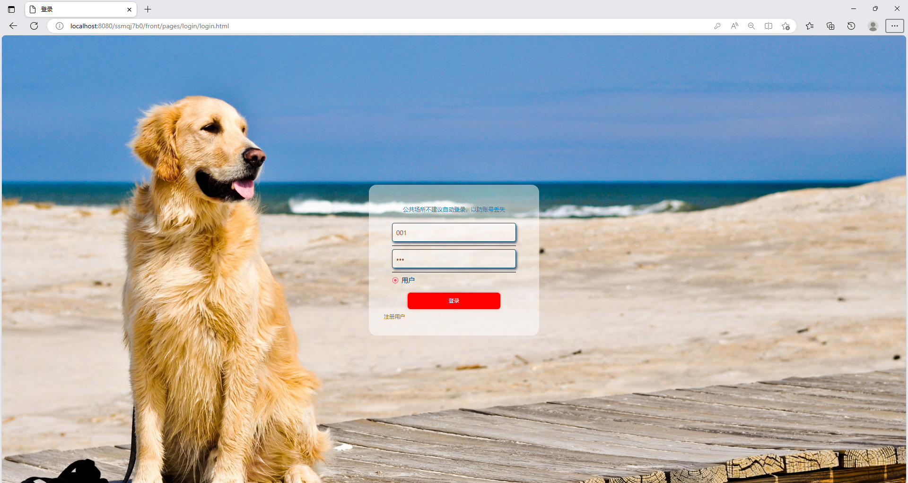
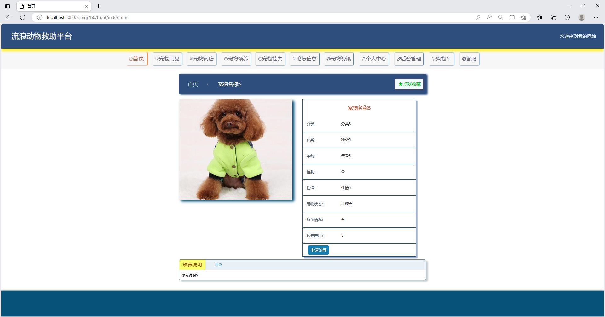
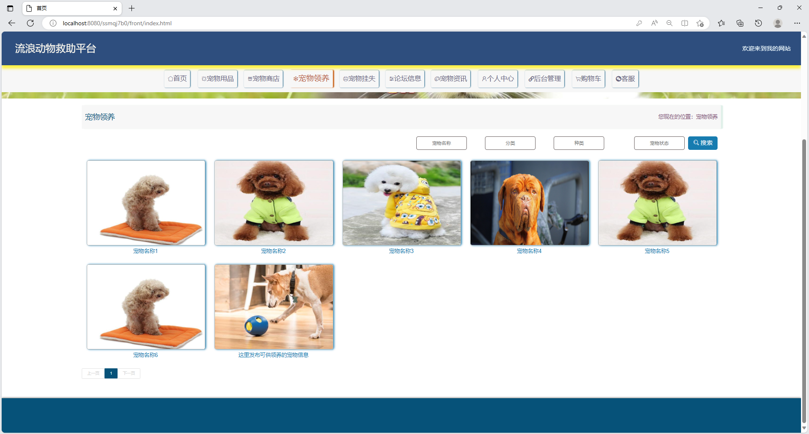
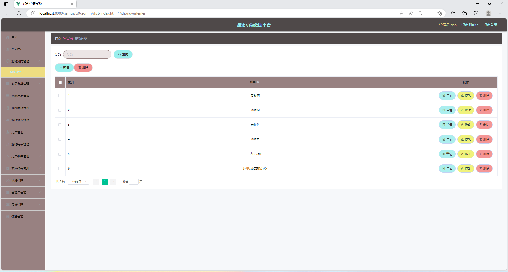
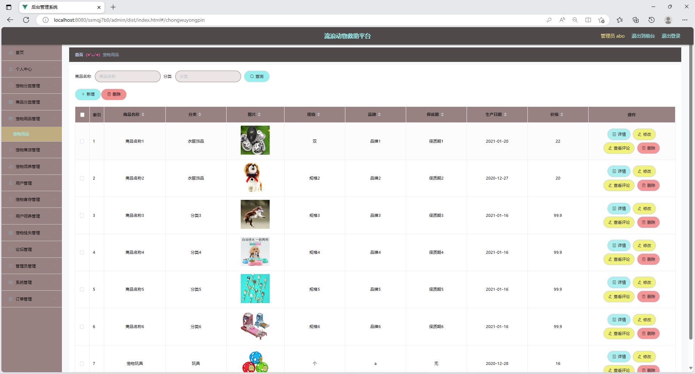
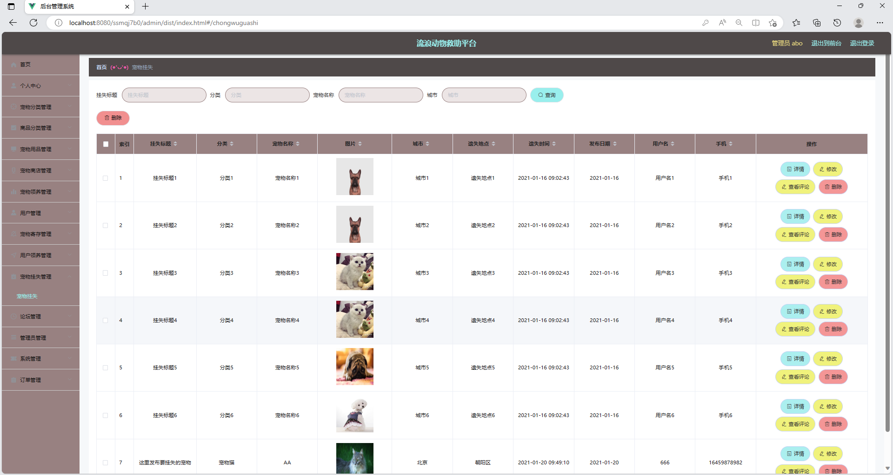

# 宠物领养系统带万字文档

### 完整项目获取

通过网盘分享的文件：进销存管理系统

链接: https://pan.baidu.com/s/1T5XqtQz4CL4FdFQBDvJaaQ?pwd=uef3 提取码: uef3
--来自百度网盘超级会员v3的分享

### 项目合集(项目不断更新中，包含java、vue、python、Android、微信小程序等项目)

链接: https://pan.baidu.com/s/1nY-zhvAK0CXYcn3g7LzQnQ?pwd=id3c 提取码: id3c
--来自百度网盘超级会员v3的分享

### 工具包

链接: https://pan.baidu.com/s/1YmdoJvkjoUjA75wvHLDZ6A?pwd=xm96 提取码: xm96
--来自百度网盘超级会员v3的分享

需要远程项目部署或项目修改和毕业设计也可联系（添加申请时请备注好来意）

### 远程调试部署联系方式

链接: https://pan.baidu.com/s/1W0dDcoZmayG0c7USJDYBYg?pwd=nqd7 提取码: nqd7
--来自百度网盘超级会员v3的分享

#### 这些项目一起发你了 可以分享给你需要的同学 调试可找我 也接二次修改和项目定制、毕业设计等

## 接毕业设计和论文

微信联系方式：xzxj0206  QQ：3808981644   (支持修改、 部署调试、 支持代做毕设)

接网站建设、小程序、H5、APP、各种系统等，单片机、嵌入式也可以做

选题+开题报告+任务书+程序定制+安装调试+论文+答辩ppt  都可以做

## 一、项目介绍

宠物领养系统，流浪动物救助平台

语言：java

运行工具：idea或eclipse 数据库：mysql

技术栈：java+ssm+vue+mysql+mybatis+maven

用户端：首页，宠物用品，宠物商店，宠物领养，宠物挂失，论坛信息，宠物咨询，个人中心，购物车

管理员后台：首页，个人中心，宠物分类管理，商品分类管理，宠物用品管理，宠物商店管理，宠物领养管理，用户管理，宠物寄存管理，用户管理系统，宠物挂失管理，论坛管理

## 二、万字论文

## 三、系统部分功能界面截图

